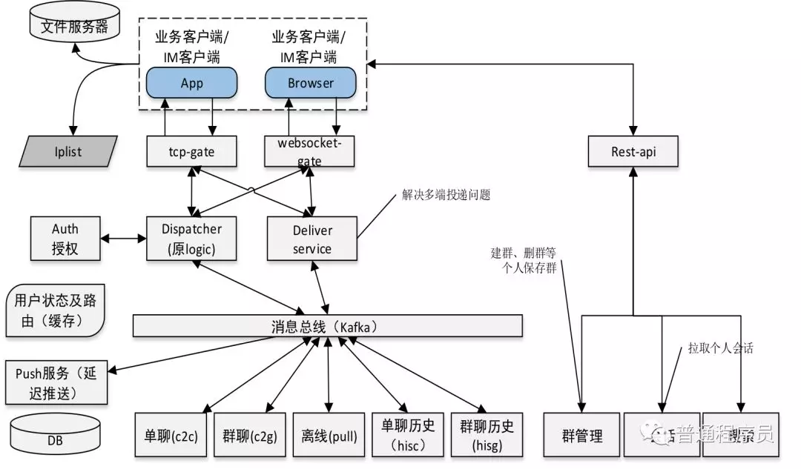

原文：https://mp.weixin.qq.com/s/TYUNPgf_3rkBr38rNlEZ2g

# 一个海量在线用户即时通讯系统（IM）的完整设计Plus

《一个海量在线用户即时通讯系统（IM）的完整设计》（以下称《完整设计》）这篇文章发出来之后有不少读者咨询问题，提出意见或建议。主要集中在`模块拆分、协议、存储`等方面。针对这些问题做个简单说明。

1、真实生产系统的模块拆分比《完整设计》一文中要`复杂`许多。《完整设计》只在反应IM系统最核心大功能点之间的关系，便于没有经验的读者能够快速上手进行IM设计和开发。真实运行系统的架构接近于这张图

2、消息存储部分，最初版本采用的MySQL，之后改成了HBase（用Cassandra也行）。按照会话进行了分区，单聊、群聊是分开存储的。

3、拉离线（消息同步模型）方式。针对内部员工采用的《完整设计》的拉取方式；针对C端用户采用了TimeLine模型。参看[《基于TimeLine模型的消息同步机制》](https://mp.weixin.qq.com/s?__biz=MzI1ODY0NjAwMA==&mid=2247483854&idx=1&sn=f87ef6cac20032e1a97076cabc36a648&chksm=ea044b51dd73c24723d13c9265dd11dd30ae143dcb44b6b8777ae125478f0b6494e9de464624&scene=21#wechat_redirect)、[《TimeLine模型下确保消息有序不丢》](https://mp.weixin.qq.com/s?__biz=MzI1ODY0NjAwMA==&mid=2247483859&idx=1&sn=51bdc587fd4a2ab6334e2ce7b82bf3f2&chksm=ea044b4cdd73c25ac7e97542f82cc248b807df613cb2e28cf2726482428bddf9a717b89fcf7d&scene=21#wechat_redirect)

4、在协议、安全等很多方面都有改进

《完整设计》一文更适合`没有`太多完全自研IM经验的研发人员阅读，基本能够覆盖到IM自研的主要环节。