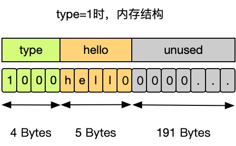
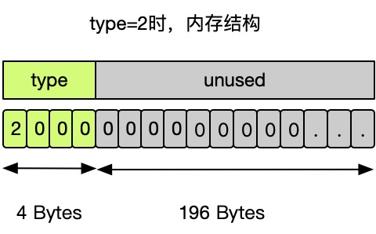
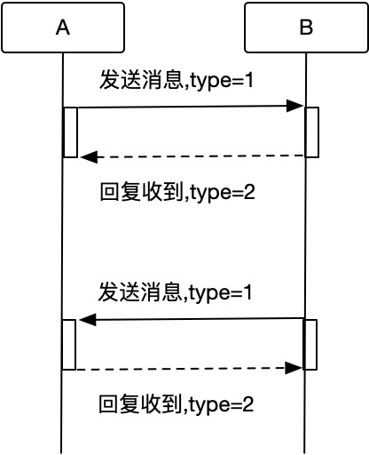
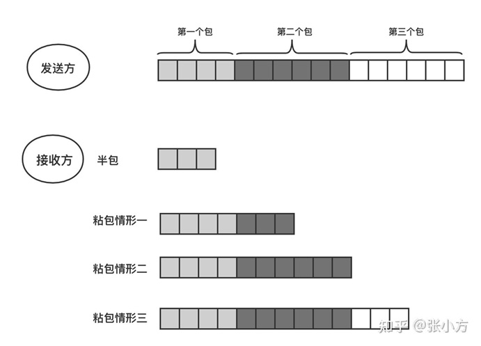
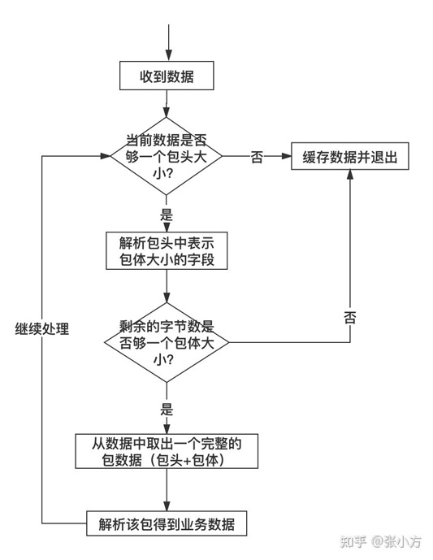
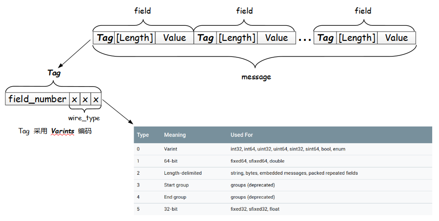

# 实现局域网P2P聊天：高级功能，自定义协议和心跳包

## 回顾

在上一章中，我们抛出了一个问题：**如何确认对方收到了我们的消息？**

要解决这个问题，需要我们`在应用层面引入确认机制`。这句话是什么意思呢，所谓应用层面，是指使用UDP发送数据包，我们需要做出区分，那个数据包是代表文本消息，那个数据包是代表确认消息。

这其实也就是自定义协议了。

## 自定义协议示例

我们先看一个例子，解释何为自定义协议。

首先，原来是直接发送一个文本：

```c++
std::string text = input_str.substr(arr[0].length() + arr[1].length() + 2, input_str.length());
// 直接发送文本
int ret = ::sendto(g_listen_fd, text.c_str(), text.length(), 0, (struct sockaddr *) &dest_addr,sizeof(dest_addr));
```

### 协议

现在，我们为了区分数据包是那种格式（确认消息或者文本内容），我们用一个整型来表示，假设使用int32_t，它是4个字节大小，因为文本内容是变长的。所为了方便解析，我们把这4个字节放在最前面，假设我们规定：

- 数据包大小是固定长度，`每一个都是200字节`。前面4个字节是一个整数，我们称之为`头部（包头）`。后面196个字节是内容，我们称之为`数据部（包体）`。

- 数据包`开始4个字节存放一个整数type`，type表示后续数据部的内容是什么

  - 当type=1时，表示该数据包是聊天消息，包的内容应该是下面的格式（假设发送的文本内容为“hello”）：

    

  - 当type=2时，代表用户收到了消息，给我方回复了一个确认包，包的内容应该如下：



- 为了明确知道对方收到了我方发送的文本消息，我们规定：`当收到一个type=1的包后，需要立即回复一个type=2的包`，即代表了我方收到了消息，给对方一个回复（任何一方收到消息，都需要回复一个ack确认）。

  

下面我们来看一下用代码怎么写。

### 封包

网络上传输的都是二进制数据，在C++中，有基本数据类型（int32_t、int16_t、string），也有自定义数据类型（Struct、Class），所以我们需要把他们转换成二进制，这个过程就叫做封包。

#### 聊天消息包

```c++
int UdpServer::sendMsgPacket(struct sockaddr_in &dest_addr, const std::string &text) {
    char tempBuff[200] = {};
    int32_t type = 1;           // type=1表示文本内容
    ::memcpy(tempBuff, &type, sizeof(type)); // 转换为二进制，使用使用memcpy
    ::memcpy(tempBuff + 4, text.c_str(), text.length()); // 注意，偏移4个字节存放文本内容

    return ::sendto(UdpServer::getInstance()->listenFd(), tempBuff, sizeof(tempBuff), 0, 						 (struct sockaddr *) &dest_addr,sizeof(dest_addr));
}
```

>  思考，为什么要使用int32_t，而不是int？int在不通的操作系统上大型不固定，在32位上可能是4个字节，在64位上可能是8个字节，我们使用int32_t现实声明这是一个4个字节的整形。

#### 确认包

```c++
int UdpServer::sendAckPacket(struct sockaddr_in &dest_addr) {
    char tempBuff[4] = {}; // 没有包体，所以只有4个字节大小
    int32_t type = 2;      // type=2表示收到消息的确认
    ::memcpy(tempBuff, &type, sizeof(type));

    return ::sendto(UdpServer::getInstance()->listenFd(), tempBuff, sizeof(tempBuff), 0,             						(struct sockaddr *) &dest_addr,sizeof(dest_addr));
}
```

#### 发送

此时，根据上面的交互图，当用户输入文字后，调用sendMsgPacket发送一个聊天消息包，如果收到对方的消息包，则需要调用sendAckPacket发送一个ack确认包。

### 解包

因为有2种情况，根据上面的约定（协议），我们知道前4个字节一定是存放了一个int32_t的，所以我们需要先读取出来，再决定后面的怎么读。

#### 读取头部（包头）

```c++
// buffer是接收缓冲区
void UdpServer::onHandle(const char *buffer, int len, struct sockaddr_in &remote_addr) {
  	int32_t type = 0;
    ::memcpy(&type, buffer, sizeof(int32_t));
    buffer += sizeof(int32_t); // 注意偏移
}
```

#### 读取数据部（包体）

读取出来之后，我们根据type来判断是确认包还是聊天消息包，再进一步解析：

```c++
if (type == 1) { // 聊天消息
    char data[196]={};
    ::memcpy(data, buffer, len);  // 读取剩余196个字节，放到data里面
}else if(type == 2){// 确认消息
    // 确认消息只有头部，数据部都是0，我们不需要读取
}
```

这个时候，就可以进行后续的逻辑处理了，是打印log，还是做其他。

#### 接收

完整示例代码如下（完整代码在[../code/chapter2/3-project-udp-chat-v2](../code/chapter2/3-project-udp-chat-v2)）：

```c++
void UdpServer::onHandle(const char *buffer, int len, struct sockaddr_in &remote_addr) {
    std::string end_point = std::string(inet_ntoa(remote_addr.sin_addr)) + ":" +
                            std::to_string(remote_addr.sin_port);
    // 我们知道前4个字节是一个整数，所以先转换出来
    int32_t type = 0;
    ::memcpy(&type, buffer, sizeof(int32_t));
    buffer += sizeof(int32_t); // 已经取了4个字节，所以往后偏移，以方便继续取

    if (type == 1) { // 消息包，继续取后面的内容
        // 我们知道后面的是文本，也就是用户输入的内容，所以直接显示即可
        char temp[196] = {}; // 因为是固定200大小，取了4个，就还有196个
        // 加一个断言，当表达式为false后，程序崩溃，使用Clion调试时，会自动跳到这里
        assert(len <= sizeof(temp));
        ::memcpy(temp, buffer, len);

        // 打印
        std::cout << "来自" << end_point << " " << std::string(temp) << std::endl;

        // 给对方回复收到
        UdpServer::sendAckPacket(remote_addr);

    } else if (type == 2) {
        std::cout << "来自" << end_point << " " << " 收到对方的确认回复" << std::endl;
    } else { // 未知的类型，显示一下即可
        std::cout << "来自" << end_point << " " << " Unknown message type:" << type << std::endl;
    }
}
```

## 协议

在汉语词典中，对于协议的解释是：

> *协议是*指两个或两个以上实体为了开展某项活动，经过协商后双方达成的一致意见

通俗点说：`协议就是约定`，双方按照某个标准或者说约定来解释一件事物，以实现秘密通信的目的。在计算机中，主要有2个方面：

- 数据包的格式：发送时按照什么格式组装数据包，收到一个数据包按照什么格式来解析
- 交互流程：我给你发送一个请求，你是否要回复，怎么回复，回复几次等等

> 思考，为什么有那么多RFC文档，比如http 1.1 [RFC2616](https://www.rfc-editor.org/rfc/rfc2616.txt)，http 2.0的 [RFC7540](https://www.rfc-editor.org/rfc/rfc7540.txt)、[RFC7541](https://www.rfc-editor.org/rfc/rfc7541.txt)

我们在 **“自定义协议示例/协议”** 一节中就给大家演示了一个简单的协议：

- 我们规定了包是固定200字节，分成头部和数据部，数据部的内容根据头部type的不同而不同。
- 我们规定了头部只有4个字节，只有1个字段type，当type=1时，代表的是聊天消息包，当type=2时，代表的是确认包。
- 我们规定收到一个type=1，即聊天消息包时，一定要回复一个type=2的确认包。

所以，上面的这些规则就是一个协议，即一系列规则的集合。

更通俗点说，电视剧里面对暗号的场景：“天王盖地虎，小鸡炖蘑菇"，也是一种约定或者说协议，只有当对方回答正确了，才能确认是自己人，然后进行下一步。

对于计算机而言呢？协议要解决的问题是，对于一串二进制而言，我们如何解析这一串010101？如何把整数、字符串转换成二进制，哪些位置放什么内容？

下面，让我们更深入的了解一些协议，我们先从标准协议开始。

### 标准协议

#### TCP协议

[配图来源](https://www.cnblogs.com/andy9468/p/10096606.html)


TCP/IP协议中，规定了前14个字节是帧头、20个字节是IP头。

当网卡收到一个数据包时，只需要按照这个格式解析前34个字节，就能从IP头里面解析出源IP和目标IP。

#### HTTP协议

另外一个著名的协议是HTTP协议，HTTP是文本协议，HTTP协议中规定了头部和数据部需要使用"\r\n\r\n"隔开，服务端收到时，只需要按照"\r\n\r\n"分割内容，就能区分数据包那一部分是头，那一部分是数据。

请求协议格式举例：

```bash
POST /index.php　HTTP/1.1 #请求行
Host: localhost
User-Agent: Mozilla/5.0 (Windows NT 5.1; rv:10.0.2) Gecko/20100101 Firefox/10.0.2 # 请求头
Accept: text/html,application/xhtml+xml,application/xml;q=0.9,/;q=0.8
Accept-Language: zh-cn,zh;q=0.5
Accept-Encoding: gzip, deflate
Connection: keep-alive
Referer:http://localhost/
Content-Length：25   # 数据部分长度，用来处理TCP粘包
Content-Type：application/x-www-form-urlencoded
           # 空行，实际上是\r\n\r\n
username=aa&password=1234 # 请求数据
```

响应格式举例：

```bash
HTTP/1.1 200 OK # 状态行
Date: Thu, 29 Nov 2018 12:56:53 GMT 
Server: Apache
Last-Modified: Thu, 29 Nov 2018 12:56:53 GMT
ETag: "51142bc1-7449-479b075b2891b"
Accept-Ranges: bytes
Content-Length: 29769    # 数据部长度
Content-Type: text/html  # 数据部内容，还有json/application格式，text/html说明是html页面
           # 空行，实际上是\r\n\r\n
<!DOCTYPE html>    # 响应数据
<html>
   .......  
</html>
```


### 何谓自定义协议

`被业界认可的，就是标准协议`（比如HTTP，TCP，他们都有RFC文档可供查阅），反之，`保密的，不公开的，则是自定义协议（又称私有协议）`。

比如著名的QQ、MSN等等即时通信工具，都是使用的私有协议。据说QQ是基于UDP实现的，因为没公开，所以，你无法查阅他们的数据包是什么格式，包含哪些交互流程。

[配图来源](https://www.cnblogs.com/andy9468/p/10096606.html)


`自定义协议是在应用层实现的`，就像HTTP协议一样都是应用层协议，你可以定义一个新的协议，HTTP使用文本，你可以使用二进制，或者使用结构体，这个取决于你。

### 自定义协议的优劣

相比标准协议，自定义协议有哪些好处呢？

优势：

- 相比标准协议，因为数据格式和交互流程不公开，所以更安全。
- 具有更高的灵活性，可以随意定制修改。
- 带宽更小，性能更高。微信之所以能在2G下工作，就是得益于其自定义协议和压缩算法。众所周知，HTTP最大的劣势就是没有压缩，及其占用带宽。

劣势：

- 没有兼容性，无法和别人的产品工作。只有你自己知道要怎么接入你的服务器，所以别人没法接进来，结果就是：你只能自己玩。
- 复杂。要实现诸多细节，肯定复杂。
- 工作量大。自己造轮子，哪有那么容易。

`采用私有协议还是标准协议，取决于具体的场景`，在即时通信这个领域下，`出于安全性、低带宽等角度考虑，通常都会使用自定义协议的方式`。

## 自定义协议进阶

文章的开头描述了一个简单的协议，实际中这样做有很多问题：

- 首先包固定长200个字节，代表用户发送的聊天消息最大只能有196个字母，98个汉字，这是不可忍受的。
- 其次对于确认包，其实只有前面4个字节有用，后面196个都没有，造成了带宽的极大浪费。

所以，我们的协议还有很大的改善空间，下面我们先系统的了解一些自定义协议都有哪些比较好的实现方式。

### 头部和数据部

在前面的例子中，我们有一个简单的4个字节的头部，要解决上面的问题，我们势必要从协议的定义上面入手。我们的头部还是太简单了，我们先来看一个粘包问题（实际中需要处理，面试也会考察）。

> 虽然我们的例子是基于UDP的，但是在实际开发中，从实现难度和效果层面衡量，我们都推荐使用TCP作为传输层协议，这里只是为了让大家方便理解。

#### 粘包问题

在实际的网络环境中，不管是TCP还是UDP，都可能遇到粘包问题。以TCP举例，可能的原因如下：

- 从数据发送的过程中，经过那些步骤来看：应用层首先要将自己的数据通过套接字发送，首先要调用一个write方法：（将应用进程缓冲区中的数据拷贝到套接口发送缓冲区SO_SNDBUF，有一个大小的限制），`如果应用进程缓冲区的一条消息的字节的大小超过了发送缓冲区的大小`，就有可能产生粘包问题，因为消息已经被分割了，有可能一部分已经被发送出去了，对方已经接受了，但是另外一部分可能刚放入套接口发送缓冲区里准备进一步发送，就直接导致接受的后一部分，直接导致了粘包问题的出现。
- TCP是基于字节流的，只维护发送出去多少，确认了多少，`并没有维护消息与消息之间的边界`，因而极有可能导致粘包问题。（应该在应用层维护一个消息边界，通常使用TLV方式实现，下文有介绍）
- 链路层所发送的数据有一个`最大传输单元（MTU）的限制（以太网的MTU是1500bytes）`，如果我们所传输的信息超过了限制，那么会在IP层进行分组，或者分片，这也可能导致消息的粘包问题的产生。
- `TCP本身的算法导致`，比如流量控制，拥塞控制算法等，也可能导致粘包
- `网络延迟`，导致收到了半包

>  [配图来源](https://www.zhihu.com/question/20210025/answer/1982654161)



通常解决方法有如下3种方式：

- **固定包长的数据包**：每个协议包的长度都是固定的。举个例子，例如我们可以规定每个协议包的大小是 64 个字节，每次收满 64 个字节，就取出来解析（如果不够，就先存起来）。
- **在包尾加结束标志**：在字节流中遇到特殊的符号时就认为到一个包的末尾了。例如，我们熟悉的 FTP协议，发邮件的 SMTP 协议，一个命令或者一段数据后面加上"\r\n"（即所谓的 **CRLF**）表示一个包的结束。对端收到后，每遇到一个”\r\n“就把之前的数据当做一个数据包。
- **包头+包体的方式**：采用包头加包体长度的方法，一般情况下，包头是定长的，假如包头是4个字节，可以先接受包头的4个字节，包头中携带一个字段，描述包体的长度，然后继续进行接收。

这3中方式中，固定包长以及加特殊符号的方式我们很少会这样使用，因为：

- 第一种：浪费带宽，试想我们如何定义这个长度？让用户只能发送10个汉字还是32个汉字？
- 第二种：选什么特殊符号好？如果用户发送的消息里面包含了\r\b，软件不是会出现BUG了？明明只发了一段话，结果你切割一下，变成了2句话。

所以，`私有协议中主要使用第三种方式：包头+包体`，我们来看几个例子。

#### 定长数据包

也就是我们开头举的例，这里不一样的是，我们放到了一个结构体里面，代码会更清晰一点，但是因为上述的问题，`实际中不会这样干`。

```c++
// 消息类型，C++11，限定作用域
enum class MsgType {
    kMsgData=1, // 代表这是消息内容
    kMsgAck,  // 代表这是确认
};

/** @fn
  * @brief
  * @param [in]aa:
  * @return
  */
struct Message {
    int32_t type;   // see MsgType
    char data[200]; // 对于不定长的字符串，我们只能规定一个长度
};
```

这个数据包长度为204


前4个字节是type，后200个字节是数据。

因为是定长结构，所以假设A给B发送了Hello的文字，`那么将浪费200-5=195个字节，这就是最大的问题`。


#### 包头+包体

包头是固定长度，比如8个字节，16个字节。包头中有一个字段，记录了数据部的长度。

```c++
struct Header {
    int len;     // 包体长度
    int cmd;     // 信令
};

// 代表一个完整的包
struct Packet {
    Header header;  // 包头
    char body[];    // 包体，c99柔性数组，必须是最后一个字段，不占内存空间
};
```

Packet在内存中的结构如下：


遇到粘包的时候，我们只要尝试读取头部，然后判断socket缓冲区余下的长度是否和超过或等于头部的长度，来决定是否处理。


处理流程如下（[来自](https://www.zhihu.com/question/20210025/answer/1982654161)）：



### TLV格式

TLV是一种可变的格式，适合变长的数据包，意为：

- Tag：该字段是关于标签和编码格式的信息
- Lenght长度：该字段是定义数值的长度
- Value值：表示实际的数值。

Tag和Length的长度固定，一般那是2、4个字节（unsigned short 或 unsigned long ,具体用哪种编码和解析统一就行了，本文就取unsigned long类型）；Value的长度由Length指定；

我个人认为TLV是一种思想，就像大数据中元数据的概念，对数据进行描述，可以做很多事情。

那么它到底有什么用呢？最出名的要数protobuf，我们待会说，先看一个问题。

**试想一个场景：随着产品迭代，突然有一天你发现需要加字段**

这是原来的结构体：

```c++
struct Message {
    int32_t type;       // see MsgType
    char data[32];      // 对于不定长的字符串，我们只能规定一个长度
};
```

你是这样解析的：

```c++
int type = uitl::ReadInt32(buffer,len); // 先读取4个字节
buffer+=4; // 偏移
char data[32]={};
::memcpy(data, buffer, sizeof(32));  // 再读区余下32个字节
```

为了代码美观，你不小心加到了这里：

```c++
struct Message {
    int32_t type;       // see MsgType
    int32_t to_user;    // 这里，增加了1个字段，占用4个字节
    char data[32];      // 对于不定长的字符串，我们只能规定一个长度
};
```

于是你通知大家一顿改，原来解析的时候，读取data数据，只需要偏移4个字节，现在要偏移8个字节了，平白增加了很多工作量。

但是这不是最恐怖的，这个功能上线后，由于你没有考虑到老版本客户端的兼容问题，于是老客户端一收到新的消息就爆炸了（2边的解析对不上，格式改变了）。

这个时候TLV就能派上用场了，我们看看protobuf是怎么使用TLV解决兼容问题的。

[配图来源](https://www.jianshu.com/p/73c9ed3a4877)



`Protobuf将每个基本的数据类型都通过TLV表示`（L可以省略，于是变成TV类型），这样每个数据都可以自描述，不必依赖前一个字段，也就解决了兼容问题。

```bash
WireType          Encoding     Length(Bytes)   Method             Type
       0            Varint              1~10      T-V   int32 int64 uint32 uint64
       1            Varint              1~10      T-V   int32 int64 uint32 uint64
       2  Length Delimited            Length    T-L-V   string bytes embeded repeated

       5    32-Bits     4-Bytes          TV      fixed32,sfixed32,float
```

[配图来源](https://gohalo.me/post/protobuf-protocol-serialize-introduce.html)


假设，一开始我们的proto定义如下（以protobuf2为例）：

```protobuf
message person {
	// wire type = 0，field_number =1
	required int32     id = 1;           // required表示：这个字段必不可少
	// wire type = 2，field_number =2
	optional string    name = 2;         // optional表示：这个字段可为空
}
```

后续又增加了一个age字段：

```protobuf
message person {
	required int32     id = 1;           
	optional string    name = 2;       
	optional int32     age = 3;          // 我们增加了一个字段，标记为可空的
}
```

因为我们标记了age是optional可选的，字段顺序是3，故原来客户端解析的代码将不受影响，皆大欢喜。

### Protobuf

通过对TLV的介绍，我们简单了解了一下protobuf，通过包头+包体（结构体）的方式，可以很好的解决固定长度包浪费带宽的问题，可以处理粘包的情况，那么，为什么还要使用protobuf？

#### 为什么使用Protobuf？

对于App网络传输协议，我们比较常见的、可选的，有三种，分别是json/xml/protobuf，我们对比一下这三种格式的优缺点：

- 优点
  - json优点就是较XML格式更加小巧，传输效率较xml提高了很多，可读性还不错。
  - xml优点就是可读性强，解析方便。
  - protobuf优点就是传输效率快（据说在数据量大的时候，传输效率比xml和json快10-20倍），序列化后体积相比Json和XML很小，支持跨平台多语言，消息格式升级和兼容性还不错，序列化反序列化速度很快。
- 缺点：
  - json缺点就是传输效率也不是特别高（比xml快，但比protobuf要慢很多）。
  - xml缺点就是效率不高，资源消耗过大。
  - protobuf缺点就是使用不太方便。

在一个需要大量的数据传输的场景中，如果数据量很大，那么选择protobuf可以明显的减少数据量，减少网络IO，从而减少网络传输所消耗的时间。考虑到作为一个主打社交的产品，消息数据量会非常大，同时为了节约流量，所以采用protobuf是一个不错的选择。

> 关于Protobuf和Json速度的对比，可以看这篇文章：[Protobuf 有没有比 JSON 快 5 倍？](https://www.infoq.cn/article/json-is-5-times-faster-than-protobuf/)

除此之外，使用protobuf还有如下好处：

- protobuf通过proto文件定义，然后通过protoc工具生成对应的C++/Java/Go等源文件，省去了手动解析结构体的过程，大大提高了效率。
- protobuf通过TLV格式，具有很好的兼容性，对于老版本的客户端，新增字段不影响解析

原理请参考：

- [深入 ProtoBuf - 编码](https://www.jianshu.com/p/73c9ed3a4877)
- [Protobuf 序列化详解](https://gohalo.me/post/protobuf-protocol-serialize-introduce.html)

#### protobuf使用

使用protobuf的步骤如下：

1. 要使用protobuf，我们需要先定义一个proto文件，这是一个中间文件，会由protoc（protobuf编码编译而来，或者直接在github release页面下载）工具翻译成对应语言的源码文件。
2. 在工程里面，包含protobuf的头文件，并且连接libprotobuf.a的库
3. 把protoc生成的xxx.pb.h和xx.pb.cc加入到工程
4. include "xxx.pb.h"来使用protobuf

下面我们来看1个例子。

##### protobuf examples

完整代码在：[../code/chapter2/6-protobuf-examples](../code/chapter2/6-protobuf-examples)

先创建2个proto文件（推荐使用vs code，然后安装protobuf插件）：

chat.base.proto：

```protobuf
// //可以进行注释，也支持/**/
syntax = "proto3";  // 声明使用protobuf3
package chat.base;  // 相当于C++中的namespace
option java_package = "com.xmcy0011.chat.pb"; // java中的包名

// enum关键字定义一个枚举
enum MsgType{
    // 必须有一个默认值，如果以后升级，新增字段，老版本客户端解析时找不到枚举值，就会设置为默认值
    kMsgTypeUnknown = 0; 
    kMsgTypeText = 1;    // 文本消息
    kMsgTypeVideo = 10;  // 可以跳跃
}
```

chat.msg.proto：

```protobuf
syntax = "proto3";
package chat.msg;
option java_package = "com.xmcy0011.chat.msg"; // java中的包名

import "chat.base.proto"; // 导入，此时可以使用里面的内容

// 通过message定义一个结构体
message MessageData {
    uint32 to = 1;
    chat.msg.MsgType msgType = 2;  // 引用chat.base.proto中的MsgType枚举
    string msg = 3;     // 字符串，不定长度
    optional bytes attach = 4;   // 字节数组，不定长度，这个字段可以为空，增加了optional选项
}

message MessageListRsp {
    repeated MessageData msg_list = 1; // 还可以声明列表
}
```

更多语法可以看官方文档：

- [Language Guide (proto3)](https://developers.google.com/protocol-buffers/docs/proto3)
- [语言指南 (proto3)](https://developers.google.com/protocol-buffers/docs/proto3)

#### 下载编译protobuf

```bash
$ wget https://github.com/protocolbuffers/protobuf/releases/download/v3.17.3/protobuf-cpp-3.17.3.tar.gz
$ tar -zxvf protobuf-cpp-3.17.3.tar.gz
# --enable-shared=no 可指定使用静态库
$ ./configure --prefix=/usr/local/protobuf3    # prefix：安装位置，即动态库等生成到这里
$ make  # 编译
$ make check
$ sudo make install
$ sudo ldconfig # refresh shared library cache.
```

为了方便起见，我们一般会安装在系统目录下，这样在其他项目中使用时就比较方便，会在同目录的lib中生成库文件：具体参考：[make-protobuf.sh](../code/chapter2/5-project-udp-chat-v4/make-protobuf.sh)

#### 定义proto文件

参考protobuf examples一节。

#### 生成C++文件

上面编译好之后，我们在 `/usr/local/protobuf3/` 下面得到一个 `protoc` 文件，此时用这个程序把proto文件，转换为C++文件，语法如下：

```bash
# cpp_out：在当前目录输出c++文件
/usr/local/protobuf3/protoc --cpp_out=. chat.base.proto
```

执行后，我们得到了对于的头文件和源文件，如下：

```
-rw-r--r--  1 xuyc  staff   3001  7  8 15:55 chat.base.pb.cc
-rw-r--r--  1 xuyc  staff   4386  7  8 15:55 chat.base.pb.h
-rw-r--r--  1 xuyc  staff  24497  7  8 15:55 chat.msg.pb.cc
-rw-r--r--  1 xuyc  staff  22434  7  8 15:55 chat.msg.pb.h
```

#### 配置CMake工程，引入

假设我们的目录结构如下：

```bash
|-pb
|  ｜-chat.base.pb.cc
|  ｜-chat.base.pb.h
|  ｜-chat.msg.pb.h
|  ｜-chat.msg.pb.h
|-main.cpp
|-CMakeLists.txt
```

我们在CMakeLists.txt要这样配置：

```cmake
include_directories(pb) # 包含pb下面所有文件
include_directories(/usr/local/protobuf3/include) # 执行make-protobuf.sh，后头文件会拷贝到这里
link_directories(/usr/local/protobuf3/lib)  # 包含protobuf3所在库目录

target_link_libraries(protobuf_examples protobuf) # 链接protobuf动态库, -lprotobuf代表静态库
```

#### 使用protobuf

详细代码在[../code/chapter2/6-protobuf-examples](../code/chapter2/6-protobuf-examples)

使用结构体（赋值）：

```c++
#include "pb/chat.base.pb.h"
#include "pb/chat.msg.pb.h"

int main() {
    chat::msg::MessageData data = {};
    // 赋值，通过set_xxx
    data.set_msg("hello protobuf3");
    data.set_to(8007);
    data.set_msg_type(chat::base::MsgType::kMsgTypeText);
    return 0;
}
```

获取值：

```c++
std::cout << "data.to=" << data.to() << " ,data.msg=" << data.msg() << std::endl;
```

序列化和反序列化：

```c++
// data.ByteSizeLong() 返回结构体内存大小
int struct_len = data.ByteSizeLong();
char *buffer = new char[struct_len];
data.SerializeToArray(buffer, struct_len);

// 反序列化
chat::msg::MessageData newData = {};
if (!newData.ParseFromArray(buffer, struct_len)) {
  std::cout << "ParseFromArray error:" << std::endl;
}
```

列表：

```c++
chat::msg::MessageListRsp msg_list;
for (int i = 0; i < 5; i++) {
  auto it = msg_list.add_msg_list(); // 添加一个元素，返回指针，然后赋值
  it->set_to(i);
  it->set_msg("hello");
  it->set_msg_type(chat::base::MsgType::kMsgTypeText);
}

// 循环
for (int i = 0; i < new_msg_list.msg_list_size(); ++i) {
  auto &item = new_msg_list.msg_list(i);

  if (!item.has_attach()) {
    std::cout << "to=" << item.to() << " ,msg=" << item.msg() << std::endl;
  } else {
    std::cout << "to=" << item.to() << " ,msg=" << item.msg() << ", attach=" << item.attach() << std::endl;
  }
}
```

### 小结

本节介绍了私有协议实现的3种方式：

- 固定数据包
- 包头+包体
  - 固定包头+结构体
  - 固定包头+Protobuf

推荐使用第3种方式：包头+包体（protobuf），但是考虑到protobuf引入了额外的复杂度，我们本章先引入到项目中，先学会使用protobuf即可。

## 代码实现总结

### V1版本：纯文本

完整代码在：[../code/chapter2/3-project-udp-chat-v1](../code/chapter2/3-project-udp-chat-v1)

### V2版本：自定义协议，固定包长

完整代码在：[../code/chapter2/3-project-udp-chat-v2](../code/chapter2/3-project-udp-chat-v2)

以上的2种方式，我们在前面的章节中都已介绍，接下来，第3个版本通过包头+包体的方式实现，解决固定包长浪费带宽的问题。

### V3版本：自定义协议，包头+包体

完整代码在：[../code/chapter2/3-project-udp-chat-v3](../code/chapter2/3-project-udp-chat-v3)

首先，我们对V2版本的代码做出改善，除了type之外，我们增加一个length，即可解决带宽浪费的问题，如下：

原来的代码：

```c++
int UdpServer::sendMsgPacket(struct sockaddr_in &dest_addr, const std::string &text) {
    char tempBuff[200] = {};
    int32_t type = 1;           // type=1表示文本内容，type=2表示收到消息的确认
    ::memcpy(tempBuff, &type, sizeof(type));
    // 注意，偏移4个字节存放文本内容
    ::memcpy(tempBuff + 4, text.c_str(), text.length());

    return ::sendto(UdpServer::getInstance()->listenFd(), tempBuff, sizeof(tempBuff), 0, (struct sockaddr *) &dest_addr,
                    sizeof(dest_addr));
}
```

改为：

```c++
struct Header {
    int32_t len;
    int32_t cmd;
};

int UdpServer::sendMsgPacket(struct sockaddr_in &dest_addr, const std::string &text) {
    // 一个头部
    Header header = {};
    header.len = text.length();
    header.cmd = static_cast<int32_t>(MsgType::kMsgData); // 改为枚举

    int buffer_len = sizeof(Header) + text.length();
    std::unique_ptr<char> tempBuff(new char[buffer_len]); // 智能指针，结束后自动释放内存
    ::memcpy(tempBuff.get(), &header, sizeof(header)); // 填充头部
    // 注意，偏移8个字节存放文本内容
    ::memcpy(tempBuff.get() + 8, text.c_str(), text.length());

    return ::sendto(UdpServer::getInstance()->listenFd(), tempBuff.get(), sizeof(tempBuff), 0,
                    (struct sockaddr *) &dest_addr, sizeof(dest_addr));
}
```


## 参考

- [怎么解决TCP网络传输「粘包」问题？](https://www.zhihu.com/question/20210025/answer/1982654161)
- [tcp粘包问题（经典分析）](https://blog.csdn.net/msdnwolaile/article/details/50769708)
- [第1章 1.10计算机网络概述--OSI参考模型和TCP_IP协议](https://www.cnblogs.com/andy9468/p/10096606.html)
- [Type–length–value](https://en.wikipedia.org/wiki/Type%E2%80%93length%E2%80%93value)
- [TLV简介](https://www.cnblogs.com/tml839720759/archive/2014/07/13/3841820.html)
- [Protobuf 序列化详解](https://gohalo.me/post/protobuf-protocol-serialize-introduce.html)
- [深入 ProtoBuf - 编码](https://www.jianshu.com/p/73c9ed3a4877)
- [Protobuf 有没有比 JSON 快 5 倍？](https://www.infoq.cn/article/json-is-5-times-faster-than-protobuf/)
- [Protobuf的优点](https://blog.csdn.net/chehec2010/article/details/89884442)
- [Protobuf入门一：在linux下编译使用protobuf](https://blog.csdn.net/asmartkiller/article/details/89454276)
