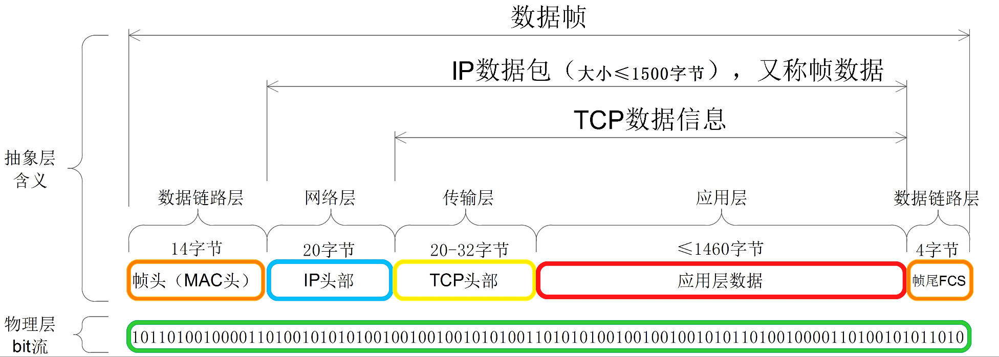

# 实现局域网P2P聊天：高级功能，自定义协议和心跳包

## 回顾

在上一章中，我们抛出了一个问题：**如何确认对方收到了我们的消息？**

要解决这个问题，需要我们`在应用层面引入确认机制`。这句话是什么意思呢，所谓应用层面，是指使用UDP发送数据包，我们需要做出区分，那个数据包是代表文本消息，那个数据包是代表确认消息。

这其实也就是自定义协议了。

## 协议

在介绍自定义协议之前，我们先来看看，什么是协议。

在汉语词典中，对于协议的解释是：

> *协议是*指两个或两个以上实体为了开展某项活动，经过协商后双方达成的一致意见

通俗点说：`协议就是约定`，双方按照某个标准或者说约定来解释一件事物。在计算机中，主要有2个方面：

- 数据包的格式：发送时按照什么格式组装数据包，收到一个数据包按照什么格式来解析
- 交互流程：我给你发送一个请求，你是否要回复，怎么回复，回复几次等等

> 思考，为什么有那么多RFC文档，比如http 1.1 [RFC2616](https://www.rfc-editor.org/rfc/rfc2616.txt)，http 2.0的 [RFC7540](https://www.rfc-editor.org/rfc/rfc7540.txt)、[RFC7541](https://www.rfc-editor.org/rfc/rfc7541.txt)

比如电视剧里面对暗号的场景：“天王盖地虎，小鸡炖蘑菇"，这算不算一种约定或者说协议，只有当对方回答正确了，才能确认是自己人，然后进行下一步。

那么对于计算机而言呢？协议要解决的问题是，对于一串二进制而言，我们如何解析这一串010101？

### 标准协议

#### TCP协议




TCP/IP协议中，规定了前14个字节是帧头、20个字节是IP头。

当网卡收到一个数据包时，只需要按照这个格式解析前34个字节，就能从IP头里面解析出源IP和目标IP，这就是协议。

#### HTTP协议

另外一个著名的协议是HTTP协议，HTTP是文本协议，HTTP协议中规定了头部和数据部需要使用"\r\n\r\n"隔开，服务端收到时，只需要按照"\r\n\r\n"分割内容，就能区分数据包那一部分是头，那一部分是数据。

请求协议格式举例：

```bash
POST /index.php　HTTP/1.1 #请求行
Host: localhost
User-Agent: Mozilla/5.0 (Windows NT 5.1; rv:10.0.2) Gecko/20100101 Firefox/10.0.2 # 请求头
Accept: text/html,application/xhtml+xml,application/xml;q=0.9,/;q=0.8
Accept-Language: zh-cn,zh;q=0.5
Accept-Encoding: gzip, deflate
Connection: keep-alive
Referer:http://localhost/
Content-Length：25   # 数据部分长度，用来处理TCP粘包
Content-Type：application/x-www-form-urlencoded
           # 空行，实际上是\r\n\r\n
username=aa&password=1234 # 请求数据
```

响应格式举例：

```bash
HTTP/1.1 200 OK # 状态行
Date: Thu, 29 Nov 2018 12:56:53 GMT 
Server: Apache
Last-Modified: Thu, 29 Nov 2018 12:56:53 GMT
ETag: "51142bc1-7449-479b075b2891b"
Accept-Ranges: bytes
Content-Length: 29769    # 数据部长度
Content-Type: text/html  # 数据部内容，还有json/application格式，text/html说明是html页面
           # 空行，实际上是\r\n\r\n
<!DOCTYPE html>    # 响应数据
<html>
   .......  
</html>
```


### 自定义协议

被业界认可的，就是标准协议（比如HTTP，TCP，他们都有RFC文档可供查阅），反之，则是自定义协议（又称私有协议）。他们不被认可的，或者故意不公开，来保护安全。

比如著名的QQ、MSN等等即时通信工具，都是使用的私有协议。据说QQ是基于UDP实现的，但是你不知道他们的数据包格式是啥，包含哪些请求。


自定义协议是在应用层实现的，就像HTTP协议一样都是应用层协议，你可以定义一个新的协议，HTTP使用文本，你可以使用二进制，或者使用结构体，这个取决于你。

### 自定义协议的优劣

优势：

- 相比标准协议，因为数据格式和交互流程不公开，所以更安全。
- 具有更高的灵活性，可以随意定制修改。
- 带宽更小，性能更高。微信之所以能在2G下工作，就是得益于其自定义协议和压缩算法。众所周知，HTTP最大的劣势就是没有压缩，及其占用带宽。

劣势：

- 没有兼容性，无法和别人的产品工作。只有你自己知道要怎么接入你的服务器，所以别人没法接进来，结果就是：你只能自己玩。
- 复杂。要实现诸多细节，肯定复杂。
- 工作量大。自己造轮子，哪有那么容易。


采用私有协议还是标准协议，取决于具体的场景，在即时通信这个领域下，出于安全性、低带宽等角度考虑，通常都会使用自定义协议的方式。

## 自定义协议实现

我们先看一些自定义协议都有哪些实现方式。

### 自定义结构体

我们以P2P聊天为例，现在我们需要知道对方是否真正收到了我方发送的消息，我们可以定义一个结构体：

```c++
// 消息类型
enum class MsgType {
    kMsgData, // 代表这是消息内容
    kMsgAck,  // 代表这是确认
};

/** @fn
  * @brief
  * @param [in]aa:
  * @return
  */
struct Message {
    int type;       // see MsgType
    char data[200]; // 对于不定长的字符串，我们只能规定一个长度
};
```

发送时，

#### 大小端问题

### TLV格式

### 头部和数据步

## V1版本：自定义结构方式

## V2版本：自定义结构体+TLV

## V3版本：TLV+Protobuf
