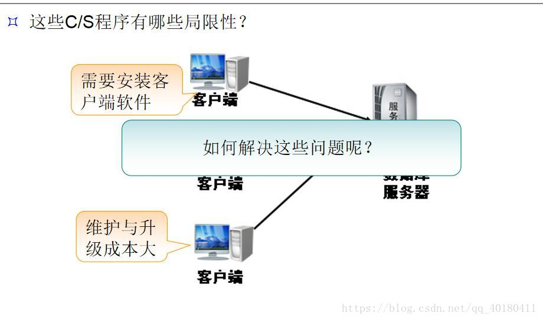
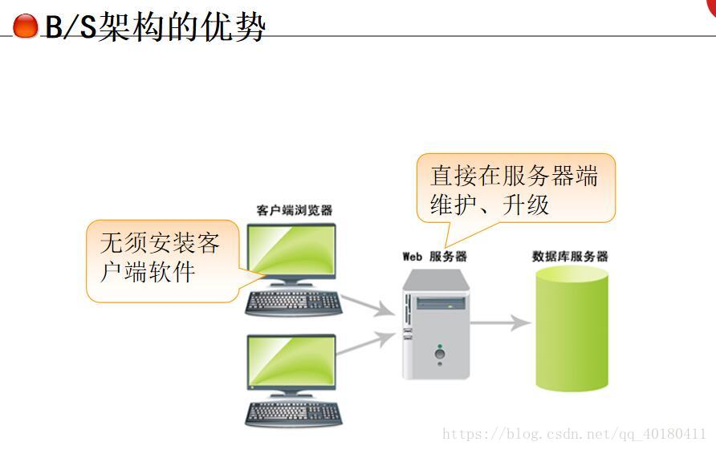

# 实现echo server（单线程）：借助第三方实现聊天机器人

## 本章内容

- 复习Linux TCP系统调用
- 实现robot server，和小微机器人聊天（微信开放平台）

## 回顾

在前面的章节中，我们实现了基于UDP的P2P简易局域网聊天程序。但是受限于P2P的使用场景，我们需要对架构做出调整。特此引入C/S架构，来解决P2P场景下的一些问题，比如消息的存储，用户的在线状态等功能在P2P下无法实现或者十分复杂。考虑到后续章节的学习，我们需要使用TCP协议来实现我们的机器人robot server。

为什么要切换到TCP协议？

- 要用好UDP太难，在3G/4G等网络状态十分不稳定的情况下，需要做大量的可靠性保证工作（超时、乱序处理、重传），那还不如使用TCP
- TCP比UDP使用的更频繁，很多开源项目都是基于TCP实现
- 为了更好的学习后续章节

## C/S、B/S和混合架构

### C/S架构

C/S架构是第一种比较早的软件架构，主要用于局域网内。也叫 客户机/服务器模式。它的特点是：用户**需要下载一个客户端，安装后才可以使用**。比如QQ,OFFICE软件等。

[配图来源](https://blog.csdn.net/qq_40180411/article/details/82250556)



### B/S架构

B/S架构的全称为Browser/Server，即浏览器/服务器结构。它的特点是：**无需安装客户端，直接在浏览器中使用**。

[配图来源](https://blog.csdn.net/qq_40180411/article/details/82250556)



### 混合架构

C/S和B/S都是比较早的叫法，`现代互联网应用都是混合架构`，构成越来越复杂，主要包括以下3种产品形态：

- 客户端（Win/Mac/Linux/Ubuntu）
- 移动端APP（Android/iOS）
- 网页前端

现在也没有一个标准的叫法，有的公司把客户端、移动端APP、网页前端统一称呼为大前端，后面的Web服务器、应用服务器统一称为后端，语言也各不相同：

- Java系列，主要是tomcat web服务器
- C++自己造轮子，可以有http web服务器、tcp服务器、udp服务器等

更多关于C/S和B/S架构的只是可以参考以下文章：

- [什么是C/S架构？什么是B/S架构？](http://www.ibloger.net/article/1086.html)
- [B/S架构与C/S架构](https://blog.csdn.net/qq_40180411/article/details/82250556)

## Client-Server模式代码示例

在 [网络编程基础：网络编程Linux API介绍](./chapter2/1-linux-system-call-examples.md) 一章中，我们详细介绍了TCP的例子，并且给出了一个echo server的代码示例。外层是一个死循环，不停的accept接受客户端的连接。从客户端连接到断开的期间，提供echo服务：即客户端发送任何内容，服务器都将回复相同的内容，就像回声一样。

通常server会为很多个客户端提供服务，即`一个服务器对成千上万的客户端`（实际中“一个服务器”并不是指一台服务器，可能有很多台，这个描述只是为了体现一对多的特点）。但是，我们运行示例的代码，就会发现一个问题：`第2个客户端必须等待第一个客户端断开后，才能成功连接`。

这是因为，我们使用了阻塞I/O，为了保持代码的简单，还使用了单线程模型。解决办法是：多线程、非阻塞I/O、I/O复用技术（最终），这些都是后续章节的内容。我们先只要知道这个问题即可。

## Robot Server实现

近些年，智能音箱技术突飞猛进，亚马逊echo音箱（售价¥2599）的出世，让国内各大互联网公司纷纷效仿，都推出了各自的智能音箱：

- 百度的小度（¥129）
- 小米的小爱同学（¥199，某东第二代）
- 喜马拉雅的小雅（¥199）
- 淘宝的天猫精灵（¥79）

这些产品中，小度和小爱同学实现的相对较好，比较聪明。那么他们的背后都是基于什么技术呢？来自 [知乎网页](https://zhuanlan.zhihu.com/p/84706310)的回答：

> 智能音箱的技术原理并不复杂。硬件上主要就是主控板、通讯组件、麦克风阵列、喇叭以及按键、灯光指示等等，硬件构成和普通手机、平板等产品类似，都是处理器、内存、Flash存储、WiFi通讯芯片等这些通用的东西。所不同的就是智能音箱更专注于语音处理，麦克风更多，构成了阵列，音箱喇叭更多，音腔更大，音质更好而已。从软件来讲，智能音箱对人类说出的自然语言进行处理，然后发出相应控制指令或者给出语音反馈。软件主要包括：语音检测（VAD)、降噪、唤醒、识别（ASR)、理解（NLU)、产生语言(NLG)、合成语音（TTS)这几个过程。语音检测用于判断是否有人类的语言，如果检测到人类语言，那就对这部分信号进行降噪（包括回声消除AEC、声源定位DOA、波束形成BF)处理，然后识别其中是否有唤醒词，如果没有则丢弃，如果有，则进入交互状态。交互状态主要包括识别(ASR)、理解（NLU)、产生语言（NLG)、语音合成（TTS)这几个部分。其中识别（ASR)和理解（NLU)主要依靠云服务，也就是智能音箱将这部分语音信号处理后发送给后台云服务，然后进行识别，识别后的语音信号就变成了字和词，对这些字和词进行分析识别，就理解了用户的意图。理解意图后就可以发送一些控制信号、搜索相关信息、查找相关内容，然后产生应答的语言，再通过语音合成变成自然语言由智能音箱的喇叭输出，如此完成交互过程。明白了原理，我们就可以分析一下市场上的这些智能音箱产品了。语音不同于其他，Echo足够优秀，但是国内使用它的人并不多，因为它不能识别中文，更别说方言了。所以，对于这类产品的分析，只能局限于国内产品。

这篇文章有更详细的描述：[智能音箱技术概览](https://blog.csdn.net/jackytintin/article/details/62040823)。

当然，这背后的实现是非常复杂的，但是有一点我们能确定：我们输入一句话，音箱给我们回复一句话，即一问一答。是不是感觉和前面Echo Server的例子有点类似？

都是客户端发送一句话，服务端回复一段话，区别在于：回复的内容是否和客户端发送的相同。这里我们会通过2个方式来解决，一个是基于网上的一个段子：[价值1个亿的AI代码](https://bbs.51cto.com/thread-1566223-1.html) 实现；另外一个是基于第三方互联网公司开放的接口来实现，可以查天气、查路线、闲聊等等。

### Echo Server回顾

实现echo功能非常简单，把客户端发过来的数据原封不动回复过去即可。

```c++
while (true) {
  char buffer[1024] = {};
  // 没有数据时会阻塞
  ssize_t len = recv(fd, buffer, sizeof(buffer), 0); // wait
  if (len == -1) {
    std::cout << "recv error:" << errno << std::endl;
    break;

  } else if (len == 0) {
    std::cout << "remote close the connection" << std::endl;
    break;

  } else {
    std::cout << "recv: " << buffer << ",len=" << len << std::endl;
    // echo
    len = send(fd, buffer, len, 0);
    if (len == -1) {
      std::cout << "send error:" << errno << std::endl;
      break;
    }
  }
}
```

### 实现价值1个亿的AI代码

```bash
我：在吗？
AI：在！
我：你好
AI：你好
我：能听懂汉语吗？
AI：能听懂汉语！
我：真的吗？
AI：真的
```

这其实是网络的上的段子，据说有的创始人靠这段代码获得了价值1个亿的公司估值。它的实现原理如下（java）：

```java
str = str.replace("吗",""); // 去掉“吗”
str = str.replace("?","!"); // 替换？号
str = str.replace("？","!"); // 替换全角？号
```

在c++中，全角符号占2个汉字，可以使用wstring处理。这不是我们的重点，所以掠过。根据上面的替换逻辑，只需要在发送前替换一下即可，示例代码如下：

```c++
// 字符串替换
void replace_all(std::string &origin, const std::string &mark, const std::string &replacement = "") {
    std::size_t pos = origin.find(mark);
    while (pos != std::string::npos) {
        origin.replace(pos, mark.length(), replacement);
        pos = origin.find(mark);
    }
}

int main(){
  // ...

  std::string text(buffer, len);
  replace_all(text, "吗");
  replace_all(text, "?", "!");

  // echo
  len = send(fd, text.c_str(), text.length(), 0);
  if (len == kSocketError) {
    std::cout << "send error:" << errno << std::endl;
    break;
  }

  // ...
}
```


## 参考

- [什么是C/S架构？什么是B/S架构？](http://www.ibloger.net/article/1086.html)
- [B/S架构与C/S架构](https://blog.csdn.net/qq_40180411/article/details/82250556)
- [价值一亿的AI核心代码，免费赠送给各位，拿走不谢](https://bbs.51cto.com/thread-1566223-1.html)

