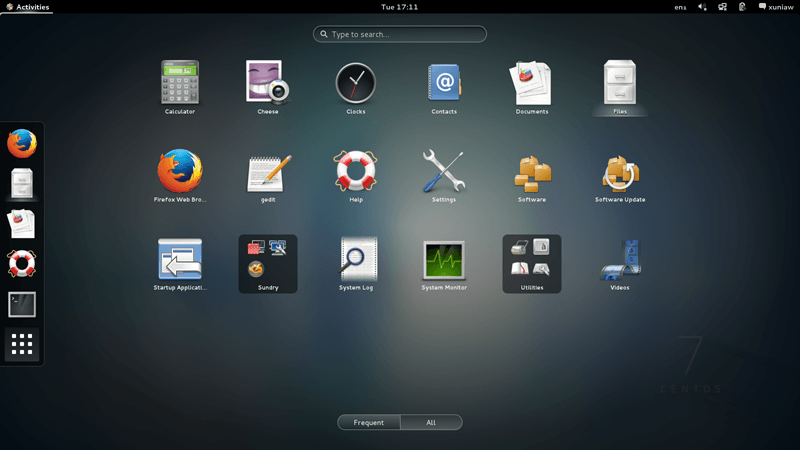
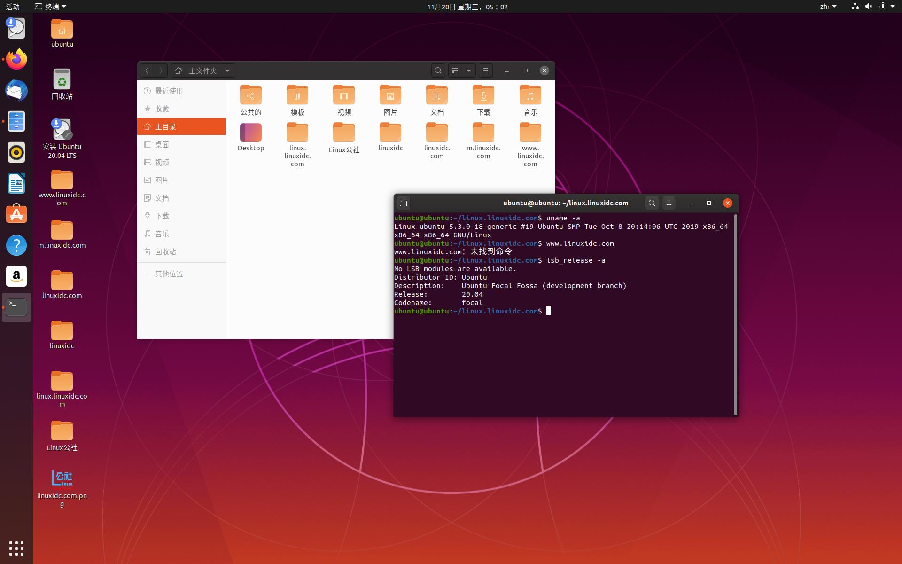
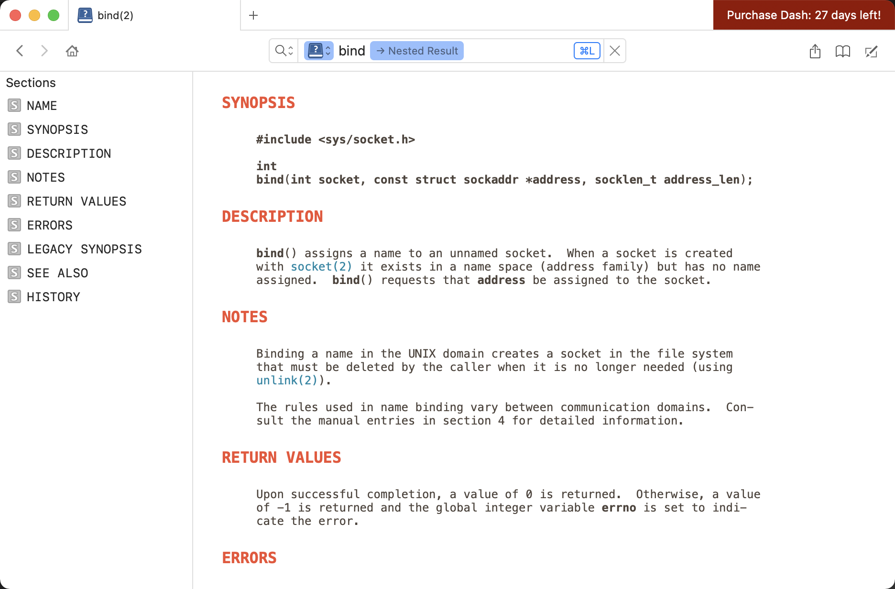

# Linux开发环境

十多年以前，还有很多公司使用Windows来充当服务器，但是目前由于云计算的兴起，很少有人这样干了。

如果你用过阿里云，创建一台ECS服务器，选择linux操作系统的时候，会发现系统默认选择了CentOS，下面介绍一下常用的Linux发行版。

## 常用Linux发行版
### CentOS 6/7

CentOS是目前国内互联网公司最喜欢用的Linux发行版，作者所在公司也在使用，主要以CentOS 6和7为主，**一般都是用作服务器**，也有一部分开发者通过虚拟机安装GUI在CentOS下开发调试，相比Ubuntu界面稍微丑一点，但是部署方便，不用折腾Ubuntu和CentOS包之间的差异。

2021.03.03 更新：CentOS 6官方已经不再维护，建议至少使用CentOS 7，CentOS 8都已经出来8.4以上了，也可以尝试。

附：[为什么国内互联网公司喜欢用Centos而不是Ubuntu/Debian？](https://www.zhihu.com/question/22814858/answer/1021837340)

### Ubuntu/Debian

这2个放在一起说，我记得2013-2017年左右，公司开发LinuxC/C++的程序，有以下几种方式：
- 交叉编译（在win上编译linux程序）
- 远程编译（把源码远程拷贝到Linux机器上）
- 本地编译+GUI界面，比如CentOS选择带界面安装，搭配Eclipse编辑器
- 追求美观的，可能会使用Ubuntu/Debian系统，或者有条件的也可以适用MacOS（作者2018年开始是这种方式）

所以Ubuntu/Debian**一般比较适合个人开发环境**。下面是一张CentOS7（上）和Ubuntu20（下）的界面对比图：
  


我个人比较喜欢Ubuntu，对于新手，还是推荐使用CentOS的GUI，这样部署的话能方便一些。

目前作者在Linux下进行C/C++开发，主要有2套环境，可供读者参考：
- Ubuntu系列：
     - 编辑器IDE：Clion（跨平台C/C++IDE，来自于Intellij）、Goland、VS Code
     - 编译器：gcc、g++
     - API手册：linux man pages
     - Git客户端：GitKraken（收费），可直接在Ubuntu Software中搜索替代品
- MacOS系列：
     - 编辑器IDE：Clion、Goland、VS Code
     - 编译器：clang
     - API手册：Dash（6.0之后开始收费了，可以下载5.x的版本免费使用）、BSD System Calls Manual
     - Git客户端：Sourcetree（免费，好用，支持windows和mac，要是能支持ubutun就更好了）

如果要尝试使用ubuntu20，那这里有一篇文章或许能帮助到你。  
- [ubuntu20搭建C++开发环境](https://blog.csdn.net/xmcy001122/article/details/114304795)

## IDE推荐
除了VS Code和Clion之外，还有很多其他编辑器，如QT Creator，vim，eclipse等。当然这些我没有用过，就一笔带过了，下面推荐2款非常流行的跨平台IDE。

### VS Code(推荐)

轻量级IDE，适合前端开发、写文档和看代码等等，因为其具有丰富的插件和跨平台的特性，不管是Java、Python、Go、C++等开发都必装的一款软件。

VS Code完全免费，由微软维护，可以在[官网下载](https://code.visualstudio.com/)。

### Clion(推荐)

跨平台C++开发工具，和Intellij Idea是一家公司，相比Windows下的Visual Studio也相差无几。在Mac、Linux、Ubuntu等环境下开发C/C++，强力推荐，代码高亮、模板、跳转、查找定义和引用、断点调试等等功能应有尽有，使用CMake来管理项目。

## 在线API手册

Linux Kernel:
- The Linux Kernel API: [https://www.kernel.org/doc/htmldocs/kernel-api/](https://www.kernel.org/doc/htmldocs/kernel-api/)

Linux C：
- The GNU C Library: [https://www.gnu.org/software/libc/manual/html_node/](https://www.gnu.org/software/libc/manual/html_node/)
- Linux Programmer's Manual & User Commands: [https://www.kernel.org/doc/man-pages/](https://www.kernel.org/doc/man-pages/) 
- 或者使用Bing搜索Linux Programmer's Manual: [http://global.bing.com/search?q=site:man7.org epoll](http://global.bing.com/search?q=site:man7.org epoll)
- Linux C API 参考手册: [https://wizardforcel.gitbooks.io/linux-c-api-ref/content/144.html](https://wizardforcel.gitbooks.io/linux-c-api-ref/content/144.html)

C++:
- cppreference: [https://en.cppreference.com/w/](https://en.cppreference.com/w/)。这个网站我经常用，新特性会标注属于C++11，还有不错的例子，网站也比较漂亮。
- cplusplus: [http://www.cplusplus.com/reference/](http://www.cplusplus.com/reference/)。有时候用以下，和上面的互补吧。

索引网站：
- 常用API文档索引: [https://tool.oschina.net/apidocs/apidocapi=jdk-zh](https://tool.oschina.net/apidocs/apidocapi=jdk-zh)

除了以上的在线网站，一般看[《Linux-UNIX系统编程手册（上、下册）》](https://book.douban.com/subject/25809330/)，会有比较详细的描述。

同时，使用Linux的man命令，可以很方便的查看各种API的详细说明。

此外，有三种标准：BSD(MacOS)、POSIX和GNU(Linux)，关于这几种标准，可以参考：
- [聊聊我理解的ANSI C、ISO C、GNU C、POSIX C](https://segmentfault.com/a/1190000012461553)。
- [UNIX/Linux/BSD、POSIX、GNU](https://blog.csdn.net/guo1988kui/article/details/81071681)

反正只要记住：
- Linux API：以 **The GNU C Library** 、 **man: Linux Programmer's Manual** 和 **《Linux-UNIX系统编程手册（上、下册）》** 为准即可。
- MacOS API：参考MacOS中的 **man: BSD Library Functions Manual** ，这方面笔者经验不多，请大家自行查找。

## man命令

安装(centos7)： 
```bash
$ yum install man               # 安装man
$ yum list|grep man.*zh         # 搜索man的中文包
man-pages-zh-CN.noarch                      1.5.2-4.el7                @base
$ yum install man-pages-zh-CN   # 安装
```

macos的话，好像是自带有该命令。如果没有，可以google一下教程。

使用（MacOS）：
```bash
$ man fread
FREAD(3)                 BSD Library Functions Manual                 FREAD(3)

NAME
     fread, fwrite -- binary stream input/output

LIBRARY
     Standard C Library (libc, -lc)

SYNOPSIS
     #include <stdio.h>

     size_t
     fread(void *restrict ptr, size_t size, size_t nitems, FILE *restrict stream);

     size_t
     fwrite(const void *restrict ptr, size_t size, size_t nitems, FILE *restrict stream);

DESCRIPTION
     The function fread() reads nitems objects, each size bytes long, from the stream pointed to by stream,
     storing them at the location given by ptr.

     The function fwrite() writes nitems objects, each size bytes long, to the stream pointed to by stream,
     obtaining them from the location given by ptr.
```

使用（CentOS）：
```bash
$ man fopen # 不知道为什么，Linux上man fread没有结果，后续这里找到问题了再修正。
FOPEN(3)                                      Linux Programmer's Manual                                      FOPEN(3)

NAME
       fopen, fdopen, freopen - 打开流

SYNOPSIS 总览
       #include <stdio.h>

       FILE *fopen(const char *path, const char *mode);
       FILE *fdopen(int fildes, const char *mode);
       FILE *freopen(const char *path, const char *mode, FILE *stream);

DESCRIPTION 描述
       函数 fopen 打开文件名为 path 指向的字符串的文件，将一个流与它关联。

       参数 mode 指向一个字符串，以下列序列之一开始 (序列之后可以有附加的字符):
```

## Dash for mac

有一款很好用的API查看软件，从6.0之后开始收费，可以下载5.0的版本（链接: https://pan.baidu.com/s/1JHNDbiwejRdeRWOoRmLZlg  密码: p040）。其还有一个Ubuntu的开源免费版本**Zeal**可以尝试，只不过好像无法安装Linux man pages，可能用处有限。

  
