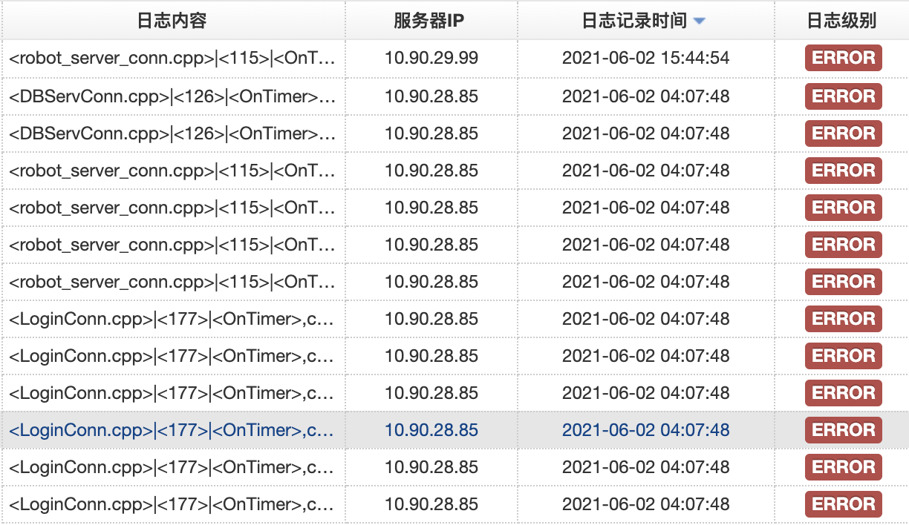
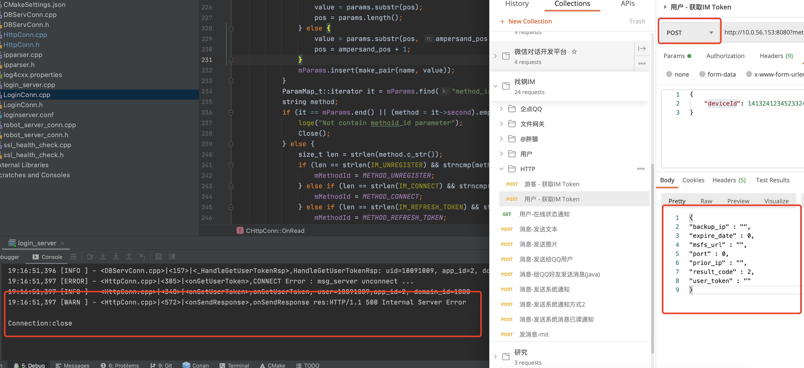

# 负载均衡服务实现

## 引言

## 负载均衡算法的选择

## 最小连接算法如何更新用户数

## 健康检查功能

### 什么是健康检查

在集群的环境下，我们通常把一个服务部署在多台机器上，以提高性能和可用性。如果其中一台机器异常（可能是物理损坏或者断网断电，也可能是程序BUG导致进程崩溃等），那么我们应该移除这个异常节点，不能对外提供服务。

这就需要我们自己实现一套心跳机制，定时的去向各个节点发起请求，如果在一定时间内响应，则认为正常。如果在一定时间内失败N次，则认为节点异常，并且启动间隔X秒后重试的逻辑，以便异常节点恢复后，能正常加入集群对外提供服务。

### Nginx的健康检查

#### 被动健康检查

最经典的就是Nginx的健康检查功能，社区版自带的功能比较弱，只能被动的去检查。以下面的配置举例：

```conf
upstream cluster{
		# max_fails=1和fail_timeout=10s 表示每10s失败1次，就把节点标记为不可用，下次
		# 并等待下一个周期（同样时长为fail_timeout）再请求，判断是否连接成功。
    server 172.16.0.23:80  max_fails=1 fail_timeout=10s;
    server 172.16.0.24:80  max_fails=1 fail_timeout=10s;
}

server {
    listen 80;
    server_name test.com; 
    location / {
      proxy_pass         http://cluster;
    }
}
```

Nginx只有当有访问时，才发起对后端节点的探测。如果本次请求中，节点正好出现故障，Nginx依然将请求转交给故障的节点，然后再转交给健康的节点处理，所以不会影响到这次请求的正常进行。但是会影响效率，因为多了一次转发，而且自带模块无法做到预警。

#### 主动健康检测（第三方模块）

由于Nginx自带的被动健康检查的功能比较弱，故各种商业版Nginx都有其增强的实现。目前各大互联网公司用的比较多的是基于淘宝开源实现的 [nginx_upstream_check_module](http://tengine.taobao.org/document_cn/http_upstream_check_cn.html)模块。他的原理是：Nignx定时主动地去ping后端的服务列表，当发现某服务出现异常时，就把该服务从健康列表中移除，当发现某服务恢复时，又能够将该服务加回健康列表中。

相比Nginx自带的模块，它可以主动的定时去检查服务的健康状态，增加了更多精细化的控制。比如超时时间、成功几次才算服务正常（rise）、发送请求的内容等

##### 第三方模块安装

>  拿centos 7举例

1. 安装nginx，查看版本

```bash
$ yum install nginx
$ nginx -V
nginx version: nginx/1.16.1
built by gcc 4.8.5 20150623 (Red Hat 4.8.5-44) (GCC)
built with OpenSSL 1.1.1c FIPS  28 May 2019 (running with OpenSSL 1.1.1g FIPS  21 Apr 2020)
TLS SNI support enabled
configure arguments: --prefix=/usr/share/nginx --sbin-path=/usr/sbin/nginx --modules-path=/usr/lib64/nginx/modules --conf-path=/etc/nginx/nginx.conf --error-log-path=/var/log/nginx/error.log --http-log-path=/var/log/nginx/access.log --http-client-body-temp-path=/var/lib/nginx/tmp/client_body --http-proxy-temp-path=/var/lib/nginx/tmp/proxy --http-fastcgi-temp-path=/var/lib/nginx/tmp/fastcgi --http-uwsgi-temp-path=/var/lib/nginx/tmp/uwsgi --http-scgi-temp-path=/var/lib/nginx/tmp/scgi --pid-path=/run/nginx.pid --lock-path=/run/lock/subsys/nginx --user=nginx --group=nginx --with-file-aio --with-ipv6 --with-http_ssl_module --with-http_v2_module --with-http_realip_module --with-stream_ssl_preread_module --with-http_addition_module --with-http_xslt_module=dynamic --with-http_image_filter_module=dynamic --with-http_sub_module --with-http_dav_module --with-http_flv_module --with-http_mp4_module --with-http_gunzip_module --with-http_gzip_static_module --with-http_random_index_module --with-http_secure_link_module --with-http_degradation_module --with-http_slice_module --with-http_stub_status_module --with-http_perl_module=dynamic --with-http_auth_request_module --with-mail=dynamic --with-mail_ssl_module --with-pcre --with-pcre-jit --with-stream=dynamic --with-stream_ssl_module --with-google_perftools_module --with-debug --with-cc-opt='-O2 -g -pipe -Wall -Wp,-D_FORTIFY_SOURCE=2 -fexceptions -fstack-protector-strong --param=ssp-buffer-size=4 -grecord-gcc-switches -specs=/usr/lib/rpm/redhat/redhat-hardened-cc1 -m64 -mtune=generic' --with-ld-opt='-Wl,-z,relro -specs=/usr/lib/rpm/redhat/redhat-hardened-ld -Wl,-E'
```

2. 下载Nginx和第三方插件

```bash
$ wget http://nginx.org/download/nginx-1.16.1.tar.gz  # 下载nginx
$ git clone https://github.com/yaoweibin/nginx_upstream_check_module.git # 插件
# 安装编译nginx所需依赖
$ yum -y install gcc-c++ pcre-devel openssl openssl-devel libxml2 libxml2-dev libxslt-devel autoconf automake gd gd-devel perl-devel perl-ExtUtils-Embed libuuid-devel libblkid-devel libudev-devel fuse-devel libedit-devel libatomic_ops-devel
```

3. 为Nginx打补丁

```bash
$ tar zxf nginx-1.16.1.tar.gz
$ cd nginx-1.16.1
# 根据nginx的版本打对应的版本
$ patch -p1 < ../nginx_upstream_check_module/check_1.16.1+.patch
patching file src/http/modules/ngx_http_upstream_hash_module.c
patching file src/http/modules/ngx_http_upstream_ip_hash_module.c
patching file src/http/modules/ngx_http_upstream_least_conn_module.c
patching file src/http/ngx_http_upstream_round_robin.c
patching file src/http/ngx_http_upstream_round_robin.h
```

4. 编译Nginx（把nginx -V的编译参数拷贝过来，增加--add-module=../nginx_upstream_check_module）

```bash
$ ./configure --prefix=/usr/share/nginx --sbin-path=/usr/sbin/nginx --modules-path=/usr/lib64/nginx/modules --conf-path=/etc/nginx/nginx.conf --error-log-path=/var/log/nginx/error.log --http-log-path=/var/log/nginx/access.log --http-client-body-temp-path=/var/lib/nginx/tmp/client_body --http-proxy-temp-path=/var/lib/nginx/tmp/proxy --http-fastcgi-temp-path=/var/lib/nginx/tmp/fastcgi --http-uwsgi-temp-path=/var/lib/nginx/tmp/uwsgi --http-scgi-temp-path=/var/lib/nginx/tmp/scgi --pid-path=/run/nginx.pid --lock-path=/run/lock/subsys/nginx --user=nginx --group=nginx --with-file-aio --with-ipv6 --with-http_ssl_module --with-http_v2_module --with-http_realip_module --with-stream_ssl_preread_module --with-http_addition_module --with-http_xslt_module=dynamic --with-http_image_filter_module=dynamic --with-http_sub_module --with-http_dav_module --with-http_flv_module --with-http_mp4_module --with-http_gunzip_module --with-http_gzip_static_module --with-http_random_index_module --with-http_secure_link_module --with-http_degradation_module --with-http_slice_module --with-http_stub_status_module --with-http_perl_module=dynamic --with-http_auth_request_module --with-mail=dynamic --with-mail_ssl_module --with-pcre --with-pcre-jit --with-stream=dynamic --with-stream_ssl_module --with-google_perftools_module --with-debug --with-cc-opt='-O2 -g -pipe -Wall -Wp,-D_FORTIFY_SOURCE=2 -fexceptions -fstack-protector-strong --param=ssp-buffer-size=4 -grecord-gcc-switches -specs=/usr/lib/rpm/redhat/redhat-hardened-cc1 -m64 -mtune=generic' --with-ld-opt='-Wl,-z,relro -specs=/usr/lib/rpm/redhat/redhat-hardened-ld -Wl,-E' --add-module=../nginx_upstream_check_module

# 省略上面的一堆输出... 
Configuration summary
  + using system PCRE library
  + using system OpenSSL library
  + using system zlib library

  nginx path prefix: "/usr/share/nginx"
  nginx binary file: "/usr/sbin/nginx"
  nginx modules path: "/usr/lib64/nginx/modules"
  nginx configuration prefix: "/etc/nginx"
  nginx configuration file: "/etc/nginx/nginx.conf"
  nginx pid file: "/run/nginx.pid"
  nginx error log file: "/var/log/nginx/error.log"
  nginx http access log file: "/var/log/nginx/access.log"
  nginx http client request body temporary files: "/var/lib/nginx/tmp/client_body"
  nginx http proxy temporary files: "/var/lib/nginx/tmp/proxy"
  nginx http fastcgi temporary files: "/var/lib/nginx/tmp/fastcgi"
  nginx http uwsgi temporary files: "/var/lib/nginx/tmp/uwsgi"
  nginx http scgi temporary files: "/var/lib/nginx/tmp/scgi"

./configure: warning: the "--with-ipv6" option is deprecated

$ make # 编译
$ make install # 覆盖，和之前yum install nginx的位置一样，可以通过rpm -ql nginx查看包安装位置
```

安装完成之后，就可以使用健康检查功能了。

##### 配置示例

```conf
http {
    upstream cluster1 {
        # simple round-robin
        server 192.168.0.1:80;
        server 192.168.0.2:80;

        # interval：定时检查间隔
        # rise：成功多少次把节点加入到健康节点队列
        # fall：失败多少次把节点从健康节点队列移除
        # timeout：超时时间
        check interval=3000 rise=2 fall=5 timeout=1000 type=http;
        # 发生请求的url 和 内容可以配置
        check_http_send "HEAD /check.txt HTTP/1.0\r\n\r\n";
        # 返回 200-399 状态码都代表服务正常
        check_http_expect_alive http_2xx http_3xx;
    }

    upstream cluster2 {
        # simple round-robin
        server 192.168.0.3:80;
        server 192.168.0.4:80;

        check interval=3000 rise=2 fall=5 timeout=1000 type=http;
        check_keepalive_requests 100;
        check_http_send "HEAD /check.txt HTTP/1.1\r\nConnection: keep-alive\r\n\r\n";
        check_http_expect_alive http_2xx http_3xx;
    }

    server {
        listen 80;

        location /1 {
            proxy_pass http://cluster1;
        }

        location /2 {
            proxy_pass http://cluster2;
        }

        location /status {
            check_status;

            access_log   off;
            allow SOME.IP.ADD.RESS;
            deny all;
        }
    }
}
```

上面是一个配置示例，

##### 查看log

启动nginx后，我们可以在/var/log/nginx下查看是否生效：

```bash
$ tail -f /var/log/nginx/error.log
2021/06/02 15:52:03 [error] 25241#0: check time out with peer: 10.32.105.18:8008
2021/06/02 15:52:04 [error] 25242#0: send() failed (111: Connection refused)
2021/06/02 15:52:07 [error] 25242#0: send() failed (111: Connection refused)
2021/06/02 15:52:07 [error] 25241#0: check time out with peer: 10.32.105.18:8008
2021/06/02 15:52:10 [error] 25242#0: send() failed (111: Connection refused)
2021/06/02 15:52:12 [error] 25241#0: check time out with peer: 10.32.105.18:8008
2021/06/02 15:52:13 [error] 25242#0: send() failed (111: Connection refused)
2021/06/02 15:52:16 [error] 25242#0: send() failed (111: Connection refused)
2021/06/02 15:52:16 [error] 25241#0: check time out with peer: 10.32.105.18:8008
2021/06/02 15:52:19 [error] 25242#0: send() failed (111: Connection refused)
2021/06/02 15:52:21 [error] 25241#0: check time out with peer: 10.32.105.18:8008

2021/06/02 15:52:22 [error] 25242#0: send() failed (111: Connection refused)
2021/06/02 15:52:25 [error] 25242#0: send() failed (111: Connection refused)
2021/06/02 15:52:25 [error] 25241#0: check time out with peer: 10.32.105.18:8008
2021/06/02 15:52:28 [error] 25242#0: send() failed (111: Connection refused)
```


#### WebSocket代理和健康检查

除了对http可以进行健康检查外，对websocket服务也能支持，这里附带一份配置，供大家参考。Browser -> WSS -> Nginx -> WS -> Server。

```conf
upstream imwss_zhaogang{
    least_conn;
    
    server  10.90.10.7:8001;
    server  10.90.29.144:8001;
    server  10.90.10.89:8001;
    server  10.80.0.16:8001;
    server  10.80.0.17:8001;
    server  10.80.0.18:8001;

    check interval=3000 rise=2 fall=5 timeout=3000 type=tcp;
    # check_http_send "HEAD /check.txt HTTP/1.0\r\n\r\n";
    # check_http_expect_alive http_2xx http_3xx;
}

server {
    listen    80 ;
    server_name imwss.zhaogang.com;
    
    location / {
        proxy_pass http://imwss_zhaogang;
        proxy_set_header Host $host;
        proxy_set_header X-Real-IP $remote_addr;
        proxy_set_header X-Forwarded-For $proxy_add_x_forwarded_for;
        proxy_redirect  off;
        access_log  /etc/nginx/logs/imwss.zhaogang.com.log  main;
        proxy_set_header Upgrade $http_upgrade;
        proxy_set_header Connection "upgrade";
    }
}
server {
    listen 443;
    server_name imwss.zhaogang.com;
    ssl on;
    ssl_certificate /etc/nginx/ssl/zhaogang.pem;
    ssl_certificate_key /etc/nginx/ssl/zhaogang.key;
    ssl_dhparam /etc/nginx/ssl/dhparams.pem;
    ssl_protocols TLSv1 TLSv1.1 TLSv1.2;
    ssl_ciphers 'AES128+EECDH:AES128+EDH';
    ssl_prefer_server_ciphers on;
    
    location / {
        proxy_pass http://imwss_zhaogang;
        proxy_set_header Host $host;
        proxy_set_header X-Real-IP $remote_addr;
        proxy_set_header X-Forwarded-For $proxy_add_x_forwarded_for;
        proxy_redirect  off;
        access_log  /etc/nginx/logs/imwss.zhaogang.com.log  main;
        proxy_set_header Upgrade $http_upgrade;
        proxy_set_header Connection "upgrade";
    }
}
```

### 带给我们的启发

我们的负载均衡服务某种意义上就是和Nginx是重合的，但是由于本服务只负责返回给客户端TCP网关的地址，实际上客户端不通过我们进行连接，故我们也无法判断TCP网关的负载情况。此时我们势必会涉及一个用户数量的同步工作，这里就带来了一个不确定性：如果某个服务崩溃了，但是用户数量又最小，那不是每一次都给客户端返回了一个异常的服务IP，如何解决这个问题？

我们也可以参考Nginx，增一个定时器来轮询tcp网关，当失败超过一定次数时，就把该服务从健康队列移除，客户端请求tcp网关IP时，自然也就分配不到异常的节点了。

### 代码实现参考

首先定义一个结构体，保存服务的关键信息

```c++
typedef struct {
    string ip_addr1;    // 电信IP
    string ip_addr2;    // 网通IP
    uint16_t port;      // TCP端口(TSL协议)
    uint32_t max_conn_cnt; // 最大数量
    uint32_t cur_conn_cnt; // 当前连接数量
    bool is_health;             // 是否正常
    uint64_t last_check_time;   // 上一次健康检查的时间
    uint16_t fail_count;        // 检查连续失败的次数，超过一定次数，则认为失败
} msg_serv_info_t;
```

我们balancer_server和tcp_gate网关之间是通过tcp连接，所以可以定义一个全局的字典来保存所有已注册的网关信息。

```c++
void CLoginConn::_HandleMsgServInfo(CImPdu *pPdu) {
    msg_serv_info_t *pMsgServInfo = new msg_serv_info_t;
    IM::Server::IMMsgServInfo msg;
    msg.ParseFromArray(pPdu->GetBodyData(), pPdu->GetBodyLength());

    pMsgServInfo->ip_addr1 = msg.ip1();
    pMsgServInfo->ip_addr2 = msg.ip2();
    pMsgServInfo->port = msg.port();
    pMsgServInfo->max_conn_cnt = msg.max_conn_cnt();
    pMsgServInfo->cur_conn_cnt = msg.cur_conn_cnt();
    pMsgServInfo->is_health = true;
    pMsgServInfo->last_check_time = 0;
    pMsgServInfo->fail_count = 0;
  
    // 保存
    msg_server_maps_.insert(make_pair(m_handle, pMsgServInfo));

    g_total_online_user_cnt += pMsgServInfo->cur_conn_cnt;
}
```

然后启动一个全局的timer，来定时的遍历网关列表进行连接尝试，如果发现某个节点异常，则进行标记：

```c++
const uint32_t kMaxFailsCount = 3;          // 最大失败次数，超过该次数，认为msg_server异常
const uint32_t kHealthCheckTimeSpan = 5000; // 5s
const uint32_t kNextHealthCheckTimeSpan = 2 * 60 * 1000; // 2分钟后，再重新检查(3*5=15*10，取2分钟)

void check_timer_callback(void *callback_data, uint8_t msg, uint32_t handle, void *pParam) {
    uint64_t cur_time = get_tick_count();

    // epoll时间循环提供的定时器，无须处理线程同步的问题
    for (auto &item : CLoginConn::msg_server_maps_) {
        auto &msgInfo = item.second;
        if (cur_time > msgInfo->last_check_time && (cur_time - msgInfo->last_check_time) >= kHealthCheckTimeSpan) {
            msgInfo->last_check_time = cur_time;
						
            // sslConnect() 函数是通过SSL进行连接，主要封装了connect()和SSL_do_handshake()函数
            bool pass = sslConnect(msgInfo->ip_addr1, msgInfo->port);
            if (pass) { // 一次成功，就认为成功
                msgInfo->is_health = true;
                msgInfo->fail_count = 0;
            } else {
                msgInfo->fail_count++;
                if (msgInfo->fail_count >= kMaxFailsCount) { // 超过5次失败，认为掉线
                    ERROR("msg_server is down, ip=%s,port=%d,fails_count=%d,next check=after %d ms",
                          msgInfo->ip_addr1.c_str(), msgInfo->port, msgInfo->fail_count, kNextHealthCheckTimeSpan);

                    
                    // 标记节点异常，给客户端返回时，跳过该节点
                    msgInfo->is_health = false;
                    msgInfo->last_check_time = cur_time + kNextHealthCheckTimeSpan; // 2分钟后再次检查
                    msgInfo->fail_count = 0;
                } else {
                    WARN("msg_server ssl connection fail, ip=%s,port=%d,fails_count=%d",
                         msgInfo->ip_addr1.c_str(), msgInfo->port, msgInfo->fail_count);
                }
            }
        }
    }
}
```

最后，在处理客户端的请求时，对异常节点进行过滤，即实现了健康检查的功能，即使某个节点异常了（最恶心的是僵尸进程，监控系统都工作正常，但就是服务不可用），我们也不会出现饿死其他正常节点的问题。

```c++
for (it = CLoginConn::msg_server_maps_.begin(); it != CLoginConn::msg_server_maps_.end(); it++) {
  pMsgServInfo = it->second;
  if ((pMsgServInfo->cur_conn_cnt < pMsgServInfo->max_conn_cnt) &&
      (pMsgServInfo->cur_conn_cnt < min_user_cnt)
      && pMsgServInfo->is_health) { // 节点健康的情况下，才返回
    it_min_conn = it;
    min_user_cnt = pMsgServInfo->cur_conn_cnt;
  }
}
```

## 服务重试和容错机制

### 概述

这里拿teamtalk的架构举例：


LoginServer实现了负载均衡的功能，他主要负责监控MsgServer上用户的数量，然后返回一个用户数少的MsgServer地址给客户端（即最小连接）。

```json
http://localhost:8080?method_id=im.connect&user_id=10091009&app_id=2&domain_id=1000

{
    "backup_ip": "10.0.38.117",
    "expire_date": 1622822400,
    "msfs_url": "",
    "port": 8000,
    "prior_ip": "10.0.38.117",
    "result_code": 0,
    "user_token": "MzIwNTY4YjdhZGU1N2U2YzcwYzRkZTczYWFiZTdiOTQ="
}
```


但是，聪明的你肯定发现了这里存在单点故障，所以我们至少需要2个LoginServer来做备份，如果其中一个节点损坏，那么另外一个节点还可以继续服务。

为了解决LoginServer单点的问题，我们对架构做出如下演化，增加一台Nginx做反向代理：


Nginx的参考配置：

```bash
upstream login_server{
	server 10.0.38.117:8080 max_fails=1 fail_timeout=30s;
	server 10.0.50.113:8080 max_fails=1 fail_timeout=30s backup;
}

server {
	listen 8080;
	location /{
		proxy_pass http://login_server;
	}
}
```

如果其中一台服务器异常了，那么我们所有的请求都往备份服务器打，这样就能继续服务。

### 简述服务依赖

LoginServer和MsgServer之间是TCP长连接，如果这中间因为网络异常，导致其中一台LoginServer和其他MsgServer的连接暂时断开，**然后30秒后又恢复正常**。那么此时，对于Nginx而言，LoginServer还是正常的，所以请求得到响应之后就直接返回给客户端了。



我们前面介绍的健康检查功能，也可以增加对下游依赖服务的连接情况做出检查，但是这中间是有间隔的，可能这个超时就出现了30秒，但是你的健康检查发现的最小时间也是30秒，那这个空白的30秒问题如何解决？

### Nginx容错解决方案

我们发现，2台服务器中同一时间只会有一台出现网络异常，那此时，我们能把请求通过Nginx打到另外一个节点上重试吗？

从事运维的同学可能很快就给出了答案：使用Nginx的proxy_next_upstream配置（重试功能）。

```bash
upstream login_server{
	server 10.32.105.18:8080 max_fails=1 fail_timeout=30s;
	server 10.32.80.75:8080 max_fails=1 fail_timeout=30s backup;
}

server {
	listen 8080;
	location /{
		proxy_pass http://login_server;
		# 重试机制，遇到这些错误，继续把请求发到下一个节点
		proxy_next_upstream non_idempotent error timeout http_500 http_502 http_503 http_504;
		proxy_next_upstream_tries 2;
	}
}
```

如上图，2台服务器，如果10.32.105.18出现问题，返回proxy_next_upstream出现的错误情况：connect失败、超时或者出现500-504等错误码：

```c++
"HTTP/1.1 500 Internal Server Error\r\n"\
"Connection:close\r\n"\
```

则把请求继续发到下一个节点（有多少台依次往下不断重试，直到最后一台返回错误），这样我们就能对外无感知的提供服务。



这些常见的错误解释如下：

- proxy_next_upstream
  - error：与服务器建立连接，向其传递请求或读取响应头时发生错误
  - timeout ：在与服务器建立连接，向其传递请求或读取响应头时发生超时
  - invalid_header：服务器返回空的或无效的响应
  - http_500：服务器返回代码为500的响应
  - http_502：服务器返回代码为502的响应
  - http_503：服务器返回代码为503的响应
  - http_504：服务器返回代码504的响应
  - http_403：服务器返回代码为403的响应
  - http_404：服务器返回代码为404的响应
  - http_429：服务器返回代码为429的响应（1.11.13）
  - non_idempotent：通常，请求与 非幂等 方法（POST，LOCK，PATCH）不传递到请求是否已被发送到上游服务器（1.9.13）的下一个服务器; 启用此选项显式允许重试此类请求
  - off：禁用将请求传递给下一个服务器

- proxy_next_upstream_tries
  - 0：表示不限制
  - 其他：限制次数

## 参考

- [Nginx被动健康检查和主动健康检查](https://www.cnblogs.com/linyouyi/p/11502282.html)
- [Nginx实战系列之功能篇----后端节点健康检查](https://blog.51cto.com/nolinux/1594029)
- [nginx安装第三方模块nginx_upstream_check_module](https://blog.csdn.net/pcn01/article/details/105182600)
- [nginx重试机制proxy_next_upstream](https://www.cnblogs.com/cyleon/p/11023229.html)
- [proxy_next_upstream 对POST无效](https://yatesun.com/2020/02/proxy-next-upstream/)
